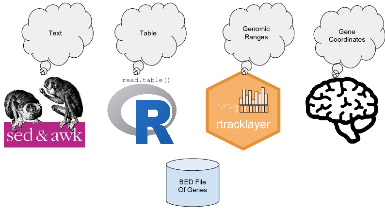
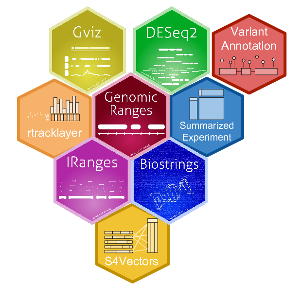

```{r Vignette setup, echo = FALSE}
knitr::opts_chunk$set(collapse = TRUE, comment = "#>")
```

# Setup your interactive copy of this tutorial

1. Open this web page in your browser so that we can copy and paste instructions:
   http://s.uconn.edu/granges
2. Open RStudio, either locally on your machine
   or by logging into the server by going to https://corelab1.mcb.uconn.edu.
3. Click on **File** > **New Project...** > **Version Control** > **Git**.
4. Set the **Repository URL** as `https://github.com/coregenomics/RangesTutorial2017.git`
   and click **Create Repository**.
5. To be able to run all the vignette commands, install the package by
   pasting the code block below in your R Console.  In RStudio you can jump to your
   R Console using the keyboard shortcut: **Ctrl + 2**:
```{r Tutorial installation, eval = FALSE}
# Change to vignettes directory to additional files.
setwd("vignettes/")
# Opens the vignette in your editor window.
file.edit("granges-intro.Rmd")

# Install the packages we need to run the tutorial.
#
# Update bioconductor installer.
source("https://bioconductor.org/biocLite.R")
# Devtools makes it convenient to work with packages.
if (!requireNamespace("devtools", quietly = TRUE))
  install.packages("devtools")
# If you already have devtools, update if not newest.
devtools::install_cran("devtools")
# Install everything required for this tutorial.
devtools::install(repos = biocinstallRepos(), dependencies = TRUE)
```

The packages might take some time to install, so we will get back to it later.
If all goes well, the last line in the R Console should be
`* DONE (RangesTutorial2017)`.

# GRanges

## BED files in R

```{r R BED file raw read}
file_bed <- system.file(package = "rtracklayer", "tests", "test.bed")
df <- read.delim(file_bed, header = FALSE, skip = 2)
df <- df[, 1:6]
colnames(df) <- c("chr", "start", "end", "name", "score", "strand")
df
```

## Reality bites

| | GFF |          |          | | | BED |          |          |
|-|-----|----------|----------|-|-|-----|----------|----------|
| | chr | start    | end      | | | chr | start    | end      |
|1| chr7| 127471197| 127472363| |1| chr7| 127471196| 127472363|
|2| chr7| 127472364| 127473530| |2| chr7| 127472363| 127473530|
|3| chr7| 127473531| 127474697| |3| chr7| 127473530| 127474697|
|4| chr9| 127474698| 127475864| |4| chr9| 127474697| 127475864|
|5| chr9| 127475865| 127477031| |5| chr9| 127475864| 127477031|

## Bioconductor validates the data

```{r R BED file import}
suppressPackageStartupMessages(library(rtracklayer))

gr <- import(file_bed)
gr

GRanges("chr11:100-1000")
# What happens when you run this?
try(GRanges("chr11:1000-100"))
```

## Moving away from file manipulation



## Where does GRanges fit with other Bioconductor packages?



## GRanges example workflow

```{r Equivalent R workflow}
suppressPackageStartupMessages({
  library(GenomicRanges)
  library(GenomicAlignments)
  library(rtracklayer)   # import
  library(OrganismDbi)   # makeTxDbFromGFF, genes
})

file_annotations <- system.file(package = "Rsamtools",
                                "extdata", "example.gtf.gz")
file_reads <- system.file(package = "Rsamtools",
                          "extdata", "ex1.bam")

# Anntations ----------------------------------------------------------

# Less optimal way of extracting genes from annotations.
annox <- import(file_annotations)
unique(mcols(annox)$type)
genes <- annox[mcols(annox)$type == "gene"]

# Better way.
txdb <- makeTxDbFromGFF(file_annotations, organism = "Homo sapiens")
txdb
genes <- genes(txdb)
genes

# Read counts ---------------------------------------------------------
reads <- readGAlignments(file_reads)
# Cobber example data.  Never do this :)
levels <- c("chr1", "chr2")
reads@seqinfo@seqnames <- levels
reads@seqnames@values <- factor(levels)

# Find reads in genes.
counts <- countOverlaps(genes, reads)
counts

# Smooth reads using windows.
genes_windows <- slidingWindows(genes, width = 250, step = 50)
counts_windowed <- relist(
  countOverlaps(unlist(genes_windows), reads),
  genes_windows)
names(counts_windowed) <- names(genes)
counts_windowed
```

## GRanges violates the concept of tidy data

Hadley Wickham explains "tidy data" in his 2014 paper:
http://vita.had.co.nz/papers/tidy-data.html
This is required reading to use the modern
R [tidyverse](https://www.tidyverse.org/) system of packages.

In a nutshell,
to make data analysis fast and painless
all variables should be columns,
and

## Exercise

## Learning resources

- Primary resources:
    - [Introduction to GRanges](https://bioconductor.org/packages/release/bioc/vignettes/GenomicRanges/inst/doc/GenomicRangesIntroduction.pdf)
    - [GRanges HOWTOs](https://bioconductor.org/packages/release/bioc/vignettes/GenomicRanges/inst/doc/GenomicRangesHOWTOs.pdf)
- GRanges replaces bedtools.
  [HelloRanges](https://bioconductor.org/packages/release/bioc/html/HelloRanges.html)
  package to ease transition.
- GRanges in the curriculum:
    - [Stanford](https://web.stanford.edu/class/bios221/labs/)
    - John's Hopkins / [Coursera](https://www.coursera.org/learn/bioconductor/lecture/0K5HA/what-is-bioconductor)

# Code clarity and neatness

```{r Magic numbers, eval = FALSE}
genes_trimmed  # Good - uses underscores to separate words
genesTrimmed   # Bad - uses mixedCase
genes.trimmed  # Bad - uses dots
```

Good names produce self-documenting code.

Follows Hadley's style http://adv-r.had.co.nz/Style.html
with additional variable naming scheme:

```{r Reverse verb convention, eval = FALSE}
promoters
promoters_windowed  # Good - variant at end
win_promoters       # Bad - "win" is not clear
windows             # Bad - relation not clear
```

In addition to 

Code reformatting in RStudio:

| Menu                  | Shortcut         | Description |
|-----------------------|------------------|-------------|
| Code > Reformat code  | Ctrl + Shift + A | Fix everything! |
| Code > Reindent lines | Ctrl + I         | Fix selection   |
| Code > Reflow comment | Ctrl + Shift + / | Fix long comment line |

## Exercise

Try out the commands from the above table

```{r Test reformatting, eval = FALSE}
# *** Reflow the long comment line below with Ctrl + Shift + / ***
#
# Read multiple BAM alignment files and simplify the GAlignments into a GRangesList object.
read_bams<-function( file_names ){
as(List(lapply( file_names, GenomicAlignments::readGAlignments )),
"GRangesList")
}

# *** Select the above code and reindent with Ctrl + I ***
# *** Select the above code and reformat with Ctrl + Shift + A ***
```

# Reduce complexity

## Stop using Bash

- Bash
    - *Glue* to put things together from different languages.
    - Mostly to use software created by C / C++.
    - Does not handle complexity well.

- R 
    - *High level* language: easy to program.
    - Reproducible: easy to install and run everything.
    - Fewer files.
    - Reports can include graphs.
    - "Scales well" with complexity.

<sub>
* The title of this section is tongue-in-cheek.
Of course Bash is useful.
Play on Jack Diederich's talk to
[stop writing classes](https://www.youtube.com/watch?v=o9pEzgHorH0) in Python.
</sub>

## Managing complexity

1. Single R script.
2. Package with R functions.
3. Unit tests (demo).
